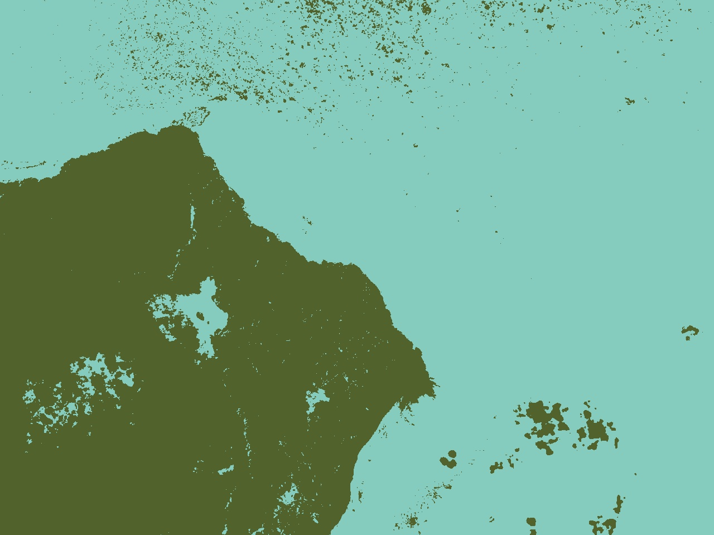

Start a clustering k-Means pixel image

### Demo

```bash
optional arguments:
  -h, --help            show this help message and exit
  -i IMAGE, --image IMAGE
                        image path
  -o OUTPUT, --output OUTPUT
                        image output
  -k K_VALUE, --k_value K_VALUE
                        k value of k-Means

# k = 2
python main.py -i input/image.jpg -o result.jpg -k 2
```
### Example
##### image input
<p align="center"></p>

##### image output
<p align="center"></p>